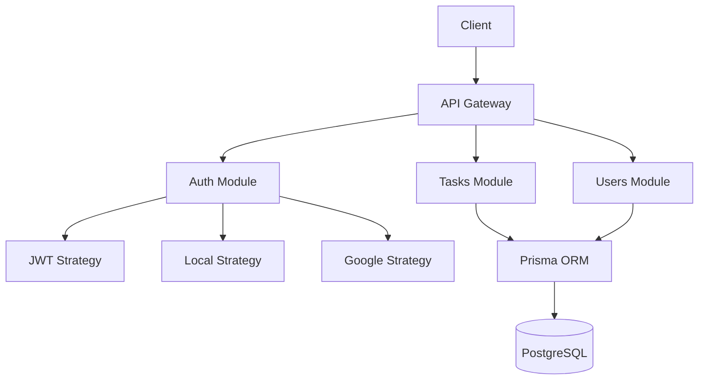

# Task Management API (NestJS + PostgreSQL)


A RESTful API with JWT authentication, role-based access control, and full CRUD operations for tasks and projects.

## 📦 Features

- **Authentication**  
  ✅ JWT with access/refresh tokens  
  ✅ Google OAuth 2.0  
  ✅ Role-based guards (`ADMIN`, `EDITOR`, `USER`)  

- **Tasks**  
  🔍 Search with query filters  
  🛠️ CRUD operations with validation  
  🔗 Relation to projects and users  

- **Infrastructure**  
  🐳 Dockerized PostgreSQL  
  📜 Swagger documentation  
  ⚡ Rate limiting (TODO)  

## 🚀 Architecture



### Key Decisions
- Modular Design: Separated auth, tasks, and users for maintainability

- Prisma ORM: Type-safe database access with auto-generated migrations

- Stateless JWT: Enables horizontal scaling

- Docker Compose: Simplified development/production parity

## 🛠️ Setup
### Prerequisites
- Node.js v18+
- Docker & Docker Compose
- PostgreSQL 14+

### Installation
Clone the repo:

```
git clone https://github.com/yourusername/task-management-api.git
cd task-management-api
```

### Configure environment variables:

```
cp .env.example .env
# Fill in your Google OAuth/JWT secrets
```

### Start services:

```
docker-compose up -d --build
```
### Run migrations:

```
docker-compose exec app npx prisma migrate dev
```

### Access APIs:

- API: http://localhost:8000

- Swagger Docs: http://localhost:8000/api

- Prisma Studio: http://localhost:5555

### 📚 Usage

## 📚 Usage

### 🔐 Authentication

| Endpoint            | Method | Description                          |
|---------------------|--------|--------------------------------------|
| `/auth/signup`      | POST   | Register new user                    |
| `/auth/signin`      | POST   | Login with email/password            |
| `/auth/refresh`     | POST   | Refresh access token                 |
| `/auth/google`      | GET    | Initiate Google OAuth flow           |

### 📝 Example Requests

#### User Registration
```
POST /auth/signup
Content-Type: application/json

{
  "email": "user@example.com",
  "name": "John Doe",
  "password": "securePassword123!"
}
```
